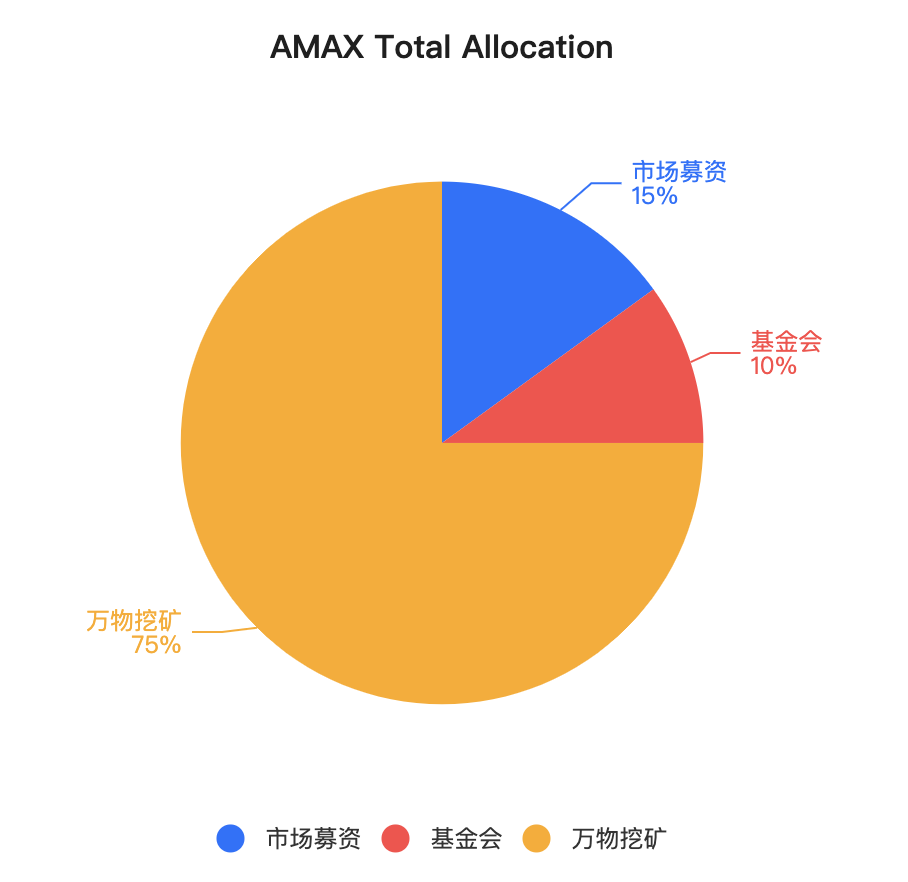

# Armonia多链区块链

> 支持一母链多子链的区块链技术平台
`v0.5`

- [Armonia多链区块链](#armonia多链区块链)
  - [介绍](#介绍)
  - [目标和原则](#目标和原则)
  - [整体架构](#整体架构)
    - [多链模型](#多链模型)
    - [多链分层架构](#多链分层架构)
    - [多链交易路由](#多链交易路由)
    - [多链体系建设应用场景](#多链体系建设应用场景)
    - [母链基本特征](#母链基本特征)
    - [母链共识机制](#母链共识机制)
    - [母链账户系统](#母链账户系统)
    - [第一条子链](#第一条子链)
    - [跨链机制](#跨链机制)
  - [通证经济模型](#通证经济模型)
    - [通证分配](#通证分配)
    - [万物皆挖矿](#万物皆挖矿)
  - [We3的建设和支持](#we3的建设和支持)
  - [xDAO治理](#xdao治理)
  - [技术路线图](#技术路线图)
  - [参考和引用](#参考和引用)
## 介绍
纵观区块链的发展历史，从最初实现分布式记账开始，到能支持各类复杂计算的智能合约技术，到提供区块链第零层(L0)的SDK帮助快速搭建新的区块链技术，以及建设专门的第二层网络(L2)技术来解决区块链第一层(L1)所无法完全满足的功能，还有实现各区块链之间的双向跨链技术，区块链技术变得越来越复杂，以满足愈加丰富多彩的上层应用。

除了满足区块链的安全、可靠、去中心化等特性，迄今为止并没有一个单一的区块链技术能够很好地满足以下特性：
- 高并发处理性能
- 模块化与可扩展
- 个性化与可定制
  
Armonia核心团队认为唯有建设一个多链架构的区块链技术平台才能实现以上目标，从而可以服务于全世界的每一位区块链爱好者和商业机构。Armonia核心团队也认为未来的元宇宙世界必定是一个去中心化的、开放式的多链森林体系，其中承载了用户、资产和交易等核心数据和基于智能合约的各类核心应用。

## 目标和原则
Armonia是一个子母链架构的多链技术平台，其中有安全、高性能且超低交易费用的母链(Armonia Mother Chain)，还有其它同构或者异构类的子链(Armonia Child Chain)并存，子链和母链之间，子链和子链之间的实现高效资产双向跨链，以实现支持全球至少十亿区块链用户为最终目标。

核心建设目标如下：
- 母链提供多链统一的账户体系和原生代币`$AMAX`，为整个多链生态提供底层价值动能和信任锚定；
- 提供L0的底层SDK模版，可以快速搭建生态内多个垂直应用型区块链子链，可以和母链进行双向的、安全的无缝资产跨链；
- 子链支持同构链或者异构链，公有链、私有链或者联盟链等各类形态，且子链可以采用不同共识机制；
- 通过母链获取所注册和锚定的web3.0所需的分布式存储、网络和计算资源提供节点，并相应激励资源提供者，为建设web3.0上层应用提供全方位底层支持；
- 成为构建元宇宙的坚实底座

设计原则：
- 安全可靠：确保母链的网络共识具有极高的去中心化特性，任何作恶可以被及时发现、惩罚和修正，确保母链承载的资产的绝对安全；
- 可扩展：通过模块化建设，把区块链实现模块像乐高积木一样可组合，可替换，并可延伸；
- 高性能：不光母链具有高TPS，通过多个子链分摊不同领域或者应用的交易，这样整个多链体系可以实现全平台超高性能支撑；
- 个性化：通过定制化的子链设计，不同的子链可以具备不同的区块链特性，来满足生态内多样性的需求；
- 简约化：凡是可以简单实现目标的，绝不过度设计和实现。通过简单模式来确保安全性、健壮和敏捷。

## 整体架构
Armonia作为一个多链架构的区块链技术平台，采用了子母链的特殊关系，而不是其它多链体系的星型模式，其结构如下图所示：

其核心设计为：
- 母链采用了特有的APoS共识机制和高性能的WASM虚拟机，采用低交易成本费用模型，和特有的账户而非地址模型
- 子链可以由平台提供的某种L0 SDK快速构建而成，可以和母链同构也可以是异构关系，
- 其他独立公链比如Bitcoin、Ethereum等也可以被包融进来，而成为多链体系里面的子链存在
- 所有子链和母链或者子链和子链之间都可以通过母链的跨链合约来完成可靠跨链
  
### 多链模型

对于采用多链平台提供的L0 SDK构建而成的子链，可以有定制化的共识模块，包括出块速度，最终确定性机制，虚拟机类型和账户地址类型等的差异。这种多样性，可定制性，可以极大的满足生态内的建设领域需求。

这类子链可以发行和拥有自己的原生代币，也可以直接采用母链的原生代币。比如说有一条子链采用了gas模型，它的gas支付可以来自于母链跨链而来的`$AMAX`原生代币。在这种情况下，子链对`$AMAX`的消耗也就增加了对母链原生代币的需求，因此可以为母链原生代币进行价值赋能。

我们把每一条单链高度抽象为字母T：其中横线代表区块链上交易和块数据，竖线代表了在某个高度上的区块链状态数据库（比如说账户余额状态）同时把开放式的公链单链用虚线包围起来，表示一个开放但是单独的网络环境。把私有链通过实线包围起来，代表一个相对封闭的网络环境。其中母链可以为所有子链的生成和信任锚定基础，以及资产交易交换的平台。整体多链系统构成了如下的区块链森林体系：

### 多链分层架构

如下图所示，在Armonia多链体系下面将出现以下的多链分层架构：

也就是说，Aromina将提供L0-base，作为L0层的通用交易路由模块。这样所有的单链的运行节点软件可以侦听同一的网络端口，但是又根据交易含有的目标路由信息来进行是否提交到更上层处理。可以在Armonia多链里面实现万链互通。

在多链分层架构下，Armonia会提供L0-base, L0, L1的模板软件和相应SDK，允许生态区块链建方可以自由选择模块、配置好参数，最后快速搭建一个个性化的单链，并且可以和生态内的各个子链和母链之间可自由交互。

### 多链交易路由

L0-base作为基础层的共用模块，里面可以提供单播、组播、和广播的三种模式的多链体系覆盖模式：

这种方式下面，用户端可以发起需要触达到某一条链，或者一组多链，或者是所有链的交易，而每个多链体系下的节点通过L0-base的实现来相应提交到更上层处理，并且决定是否转发到整个网络里面去。但是如果交易可以提升到节点软件的上层模块，由于缺乏在所在链的交易所需手续因素，交易将无法执行而无法上链。

### 多链体系建设应用场景
在多链生态体系中，可以建设包括且不限制为以下的应用场景：
- 通过母链实现生态内各类资产的发行、转移和交易、快速兑换;
- 在母链提供生态建设的各类激励矿池；
- 母链的账户支持KYC/KYB验证标签，从而支持在有监管需求的上层应用；
- 在某条子链实现基于订单簿的高性能、低延时的去中心化交易所；
- 在某条子链实现竞猜类应用的高性能平台；
- 在某条子链提供各类链游、NFT和元宇宙等落地场景。

有了多链并存，子母链之间的交互，还有和现有第三方公链之间的交互，Armonia致力建设如下的通用跨链能力：

### 母链基本特征

| 特征 | 说明 | 备注 |
|---|---|---|
| 原生代币符号 | `AMAX` | 由系统合约 **amax.token** 发行 |
| AMAX的精度 | 8 | 最小可分割为亿分之一|
| 设计总量 | 1,000,000,000 | DAO治理管控未来增发，有生态销毁机制 |
| 共识机制 | APOS | Armonia特有共识机制 |
| 虚拟机 | WASM | 高性能虚拟机 |
| 防女巫攻击 | 资源质押和租用模型，需要`$AMAX`| 交易零Gas费 | 
| 出块速度 | 1 秒 | |
| TPS | 5000+ | 基准测试为转账交易，`v1.0`即实现目标 |

### 母链共识机制

作为多链森林体系的创始母链，担当了所有其它子链的信任基石和底层价值通证来源。也就是说所有子链的原生代币必须来自于母链，用于子链的基础运作所需（例如交易燃料费使用）。因此确保母链的安全性和稳定性尤为重要。而区块链的安全性主要体现在足够的去中心化程度和抗审查能力，这在技术的实现上需要做到以下几点：

1. 有足够多的节点运行区块链的数据，这样部分甚至全部的核心记账节点如果受到攻击，全网仍然可以及时恢复运行；
2. 如果其中有运行记账和验证的节点作恶，只要是作恶节点数量小于记账节点总数的1/3，可以被全网节点及时发现并纠正；
3. 在记账节点不工作的时候，可以被及时替代出去；

Armonia核心团队针对以上建设目标，对母链采用了一种全新的区块链共识机制：APOS(Armonia DPOS) 是对DPoS的一种升级版，而其它子链可以采用独立的共识机制运行来维护自己的网络数据。

APOS共识机制的核心框架如下：
1. 全网参与挖矿的节点分成主节点和备节点，分别挖出主块和备块；
2. 主备节点经过开放式的不间断的全网投票选举出来，其中按照节点所质押加上获得所有投票的总量排名的前21名为主节点，而后面的10000名为备节点；另外通过母链的DAO组织可以对主备节点的个数进行治理调整；其余的节点只做同步不参与出块，称为观察节点；
3. 主节点间按照DPOS+VRF的方式轮流负责挖出主块，并获得相应增发收益；
4. 备选节点也通过VRF的算法来确定在每个出块的时间槽内挖出备块，并获得相应增发收益；
5. 而主节点在验证好备块后可以加入到主块的备块列表里面，并且获得相应的收益；如果主节点加错备块则挖出的主块也会变得无效而不为接受；如果主节点没有挖出主块，但是该时间槽位内的备块就转成主块，相应挖出备块的节点获得主块收益；
6. 主块的最终确定性算法采用`aBFT`，而备块通过主块来获得最终确定性；
7. 主块必须验证加执行来更新本地状态库；备块则只需验证不可真正执行，以免交易被重复执行，导致双花现象；
8. 备块收益所得按照和同高度的主块内的交易重复比例来分配，也就是说备块如果拥有主块的所有交易所，将要获得全部的备块收益。

以下为一主一备双链交织模型下的一些运行场景展示：

- 主节点和备节点出块和主块与备块之间关系如下：

- 另外，Armonia母链的主节点每次出块6块，再轮流到下一个当选出块主节点，但是从节点在每块都有可能变更。通常出块情况如下：

- 如果备节点无法按时或者准确出块，那么下一个主块将不能包含上一个时间槽的从块：

- 如果主节点无法按时或者准确出块，那么下一个主块将直接连接有效的备块作为主块，相应备节点获得主块的收益, 但是其中丢失主块包括进来的备块`n'-1`因此而丢失, 无法获得收益：

一主一备的双链架构下可以支持到10021个节点参与共同挖矿，维护网络健壮性和安全性，同时获得相应收益。为了进一步增加参与节点的数量，可以把一主一备双链变成一主双备甚至一主三备份这样的多链模型。每增加一条备链可以增加10000个备链挖矿节点。虽然单个备节点获得挖矿的数量少了，但是因为大大提升了网络的安全性，增强了社群的参与度和社群共识，随着币值相应上涨，单个备节点的收益反而可以保持或者进一步上涨。通过这种模型可以来激励更多的社群参与者来挖矿和建设整体网络。至于备份子链的冗余个数可以由Aarmonia的`DAO`组织来管理和决定。相应地，主备子链组合的可扩展场景如下所示：

另外考虑到自创世开始的第一年内，Armonia母链主要是核心团队在维护和开发，并不会立即对外开放投票，所以在第一年内即使维护和运行了21个超级节点，每一个挖出的块并没有任何增发奖励。在第二年随着节点投票的开始，新的节点引入之后，在满足一定的质押比例后（比如5%），每挖出的块都会有增发奖励给到该记账节点。

### 母链账户系统

有别于其它类似比特币、以太坊公链等采用了地址来标识用户的链上账户（通常由公钥来推导出用户地址）, Armonia母链采用了账户模型，账户绑定了一个或者多个公钥，并且需要用户提前注册好才能使用。Armonia母链规定所有的账户都由一个唯一名称来标识，名称的最大长度为12个字符（[`1-5`,`a-z`,`.`]), 未来可以扩展到24字符([`1-9`,`a-z`,`.`,`#`,`@`])。该名称由帐户的创建者指定。帐户创建者必须使用 `$AMAX`代币预留一定的RAM数值用来存储新帐户，直至新帐户质押自己的代币来预留自己的RAM。

### 第一条子链
考虑到和世界上目前最流行的以太坊区块链技术的兼容，Armonia的第一条子链采用以太坊的底层核心技术，包括EVM虚拟机和地址模型等，具体特征如下：
| 特征 | 说明 | 备注 |
|---|---|---|
| 原生代币符号 | `AMAX` | 由母链跨链而来 |
| 共识机制 | PoSA |  |
| 虚拟机 | EVM | 高性能虚拟机 |
| 防女巫攻击 | 交易需要消耗Gas，即支付`$AMAX` | 根据实际gas数量和价格的乘积来决定 |
| 账户模型 | 地址模型 | 格式：`0x...` |
| 出块速度 | 3 秒 | |
| TPS | 160+ | 基准测试为转账交易，`v1.0`即实现目标 ｜

### 跨链机制

在一个多链的生态体系里面，可以让链上发行的资产从原链映射到另外一条链或者反之是至关重要的。某种意义上讲，跨链增加了链上资产的流动性和可用性。同时，将一个资产从原链跨到另外一条链，也可以自由跨链回来，可以满足资产用户的在区块链生态内的全部需求。

但是要做到以上的双向、可靠、高效的跨链，需要解决跨链过程中涉及到的各类问题：
- 如何保障链上资产转移交易的最终确定性
- 如何把一条链的交易信息及时同步到另外一条链上去
- 如何确保跨链中各项交易执行内容的准确性和有效性
- 如何避免恶意用户利用跨链盗走资产
- 如何防止在映射的链上面的映射资产被恶意滥发并使用
  
同时还需要考虑的问题有：如何实现一种通用性的跨链解决方案，可以满足各种链之间的跨链需求，而不是为不同链定制不同跨链方案。

Armonia核心团队基于以上问题，提出了一种混合治理模型的且相对安全可靠的通用型跨链解决方案，具体如下：

说明：
| 名称 | 代号 | 
| ---- | ---- |
| Armonia母链 | `M` |
| 跨链资产所在原链 | `A` |
| 跨链资产映射目标链 | `B` |
| 跨链用户 | `BU` |
| 跨链服务商 | `BO` |
| 跨链目标资产 | `AS` |
| 跨链目标资产在目标链的治理组织 | `DAO` |

资产在A链上的分配已经由A链的共识机制、通证经济和生态发展决定了，跨链的资产在目标链B上面需要有相应的ERC20合约来承载，提供铸币、发行、转账和销毁等功能，并且这些功能由DAO来决定。

* 准备工作
1. 在M链上提供系统合约作为跨链的基础合约`amax.xswap`，记录和管控跨链同类资产兑换的全部过程；
2. 在A链部署部署合约作为跨链资产的托管合约`as_custody`；
3. 在B链部署ERC20合约`as_erc20`作为资产接收和销毁功能；同时也有动态铸币功能，铸币权由DAO来管控；

* 流程如下
1. BO找到DAO，申请在B链上的跨链资产，比如说100万枚AS；DAO在BO打入100万A链上的资产到`as_custody`,在B链上通过`as_erc20`合约铸币100万AS给BO；
1. BO开始通过`amax.xswap`上面挂上出售的订单，并且质押两倍价值的AMAX代币在该合约内；
1. BU通过`amax.xswap`找到自己愿意成交的订单，可以部分或者全部吃下该订单；
1. BU将AS资产从A链打入到BO的账户或者地址；同时将该交易`TxID`通知到`amax.xswap`的订单状态内；
1. BO在得到订单状态变更后将相应的AS资产在目标链B打入到BU的地址或者账户上，从而完成订单；
   
注：
1. 如果兑换订单产生纠纷，将由`DAO`来帮助完成仲裁过程，确保订单的正确执行或关闭；
2. 母链M也可能是A链或者B链之一。

流程示意图如下：

## 通证经济模型

Armonia的母链发行了`$AMAX`的原生代币，不光用于母链的运作所需资产，也可以为子链运行所需，甚至成为它们的原生代币。特别是由Armonia核心团队主导的子链都将采用`$AMAX`作为子链运行所需的原生代币。

`$AMAX`的设计发行总量最大值为210亿枚，但是第一阶段的设计发行量为10亿枚，并且只有实际可流通市值在100倍增长的前提下，DAO组织才考虑增发的可能性。

### 通证分配

`$AMAX`的总量分配如下：

其中, 市场募资使用`$AMAX`占总量的15%, 用来实现以下2个核心目的：
- Armonia核心团队的项目建设所需经费来源
- 释放足够的币到市场流通，允许参与竞选挖矿的节点的质押币和投票的币能够满足5%的总体质押量来激活挖矿。

市场募集份额里面又分2%的种子轮私募，3%的机构私募，和剩余10%的去中心化发行IDO。并且采用和系统质押总数成正比的Bonding curve的公式来决定`$AMAX`的动态价格。另外凡是私募的都有锁仓机制，确保市场有足够的时间运行Armonia全方位生态应用建和价值建设起来。

其次，10%的币量用于基金会，主要在市值管理和长期发展去中心化自助组织所用。其代币将存放于`amax.fund`账户，由Armonia核心团队多签管理，可以接受市场的整体监督，确保用于有助于生态发展的地方。

最后，占75%的币量将用于生态内的各类挖矿，在Armonia称为万物即挖矿。

### 万物皆挖矿
在Armonia的生态建设理念里，凡是对生态做出了某种贡献的，增加了整体价值的，都可以称为挖矿的行为，必定有相应的收益激励。

总体上从大的方面讲，有以下挖矿的方式存在：
|挖矿种类|分配比例|挖矿说明|
|---|---|---|
|公链建设挖矿 - 早期阶段 | 15% |由早期的核心团队领导完成公链的`v1.0`, `v2.0`和`v3.0`的里程碑建设|
|公链建设挖矿 - 后期阶段 | 15% |由建设而成的开发者DAO全面驱动的公链技术和生态应用的发展|
|主节点挖矿 | 5% | 30月减半机制，运行12月后改成：5年减半机制| 
|从节点挖矿 | 5% | 30月减半机制，运行12月后改成：5年减半机制|
|Web3挖矿 | 10% | 为服务和建设web3应用体系而激励生态内的相应挖矿激励 |  
|生态建设挖矿| 25% | 其它凡是有利于生态建设的各类短期或者周期性的挖矿激励 |

其中生态挖矿包括但是不限于以下类型：
- 注册邀请用户加入
- 提供KYC、KYB的供应商的服务
- 提供预言机服务的行为
- 从第三方公链把主流资产跨链过来的行为

## We3的建设和支持
要建设Web3，意味着很多中心化下的互联网的基础服务都可以在去中心化的方式下提供出来，并通过代币结算被满足应用层需求的各项基础设施服务。

Web3的去中心化服务建设包括但是不限制于以下类型：
- DFS：去中心化文件存储服务
- DCOMP：去中心化的计算服务（例：租用虚拟机后部署容器并运行一段时间的服务）
- DNET：去中心化网络服务，包括流量分发，路由服务等
- DCDN：去中心化的CDN服务
- DDNS：去中心化的域名解析服务
- DID：去中心化的身份认证服务

如果有效地衡量以上基础服务的贡献，并相应用`$AMAX`来激励，是Armonia支持web3需要解决的一个课题。

## xDAO治理
在去中心化的世界里面，技术、产品还有整个生态的发展，有很多需要优化改进的地方，这都需要有一个链下治理决策然后完成链上升级变更的过程。但是这种治理必须同样符合去中心化理念，是由社区利益相关者积极参与，通过链上投票完成各项提议复议，最后执行的过程。

因此有必要建设Armonia的各项去中心化自助组织DAO来驱动整个区块链技术、应用和生态建设和长期发展。并且我们需要有一个顶级的DAO组织来管理下级的各类DAO组织来驱动各项建设，我们把这个称为`Armonia xDAO`。

基本流程如下：

- 其中DAO智能合约由相应DAO组织来实现部署，并开放源码给到DAO组织里面的成员；
- DAO组织里面的成员也需要通过一个招募的过程完成，并通过DAO合约发行的凭证代币获得投票资格；
- DAO成员的投票数量根据DAO合约协议相应发放；
- DAO组织里面的成员都可以进行某个事项的提议，包括完成复议的奖励金额提议，可以是个人提供也可以是DAO组织提供
- DAO成员参与复议投票，可以有具体的投票截止时间，按照一币一票等规则；
- 计票后根据该轮选择的决策规则，来判定提议是否通过；
- 如果提议通过，则通过指定的执行人来完成提议的执行；
- DAO组织最后检查执行结果并完成该提议的最终状态为结束
  
Armonia里面的一些基本DAO有如下：
- 开发者DAO：负责公链开发驱动，包括功能提议实现修改和发布，并提供激励和审核机制；
- 节点DAO：负责挖矿节点之间的协调，整个区块链网络的安全保障议题事项的落实，备链挖矿的决议等；
- AMAX代币DAO：AMAX的发行和分配、机制；
- 万物挖矿：包括各项新的矿池的开设和关闭、激励来源和执行；
  
## 技术路线图

基本技术路线图如下：
- v1.0：实现多链系统的母链和第一条EVM子链的搭建和部署，母链实现APOS共识机制，双向跨链实现；
- v2.0：实现生态内开放式的web3资源共享挖矿机制和相应web3的访问技术对接；
- v3.0：实现多链的L0-base，L0, L1的模块化和模板化SDK，可以快速搭建生态内各类单链；

在实现v3.0之后的技术路线图，必将由`developer dao`来全面驱动和治理实现完成。

## 参考和引用
- DPOS: https://steemit.com/dpos/@dantheman/dpos-consensus-algorithm-this-missing-white-paper
- aBFT: https://hedera.com/learning/what-is-asynchronous-byzantine-fault-tolerance-abft
- DAO: https://consensys.net/blog/blockchain-explained/what-is-a-dao-and-how-do-they-work/
- 最终一致性：https://academy.binance.com/en/glossary/finality