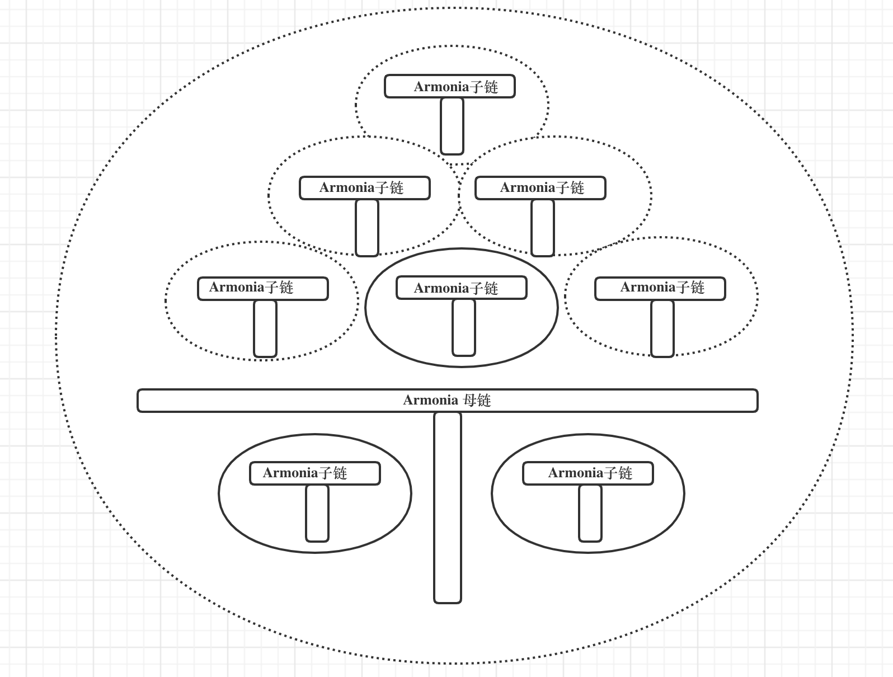

# Armonia多链区块链

> 支持一母链多子链的区块链技术平台

- [Armonia多链区块链](#armonia多链区块链)
  - [介绍](#介绍)
  - [目标和原则](#目标和原则)
  - [整体架构](#整体架构)
    - [多链模型](#多链模型)
    - [母链基本特征](#母链基本特征)
    - [跨链机制](#跨链机制)
  - [母链共识机制](#母链共识机制)
  - [通证经济模型](#通证经济模型)
    - [通证分配](#通证分配)
    - [万物皆挖矿](#万物皆挖矿)
  - [xDAO治理](#xdao治理)
  - [技术路线图](#技术路线图)
## 介绍
纵观区块链的发展历史，从最初实现分布式记账开始，到能支持各类复杂计算的智能合约技术，到提供区块链第零层(L0)的SDK帮助快速搭建新的区块链技术，以及建设专门的第二层网络(L2)技术来解决区块链第一层(L1)所无法完全满足的功能，还有实现各区块链之间的双向跨链技术，区块链技术变得越来越复杂，以满足愈加丰富多彩的上层应用。

除了满足区块链的安全、可靠、去中心化等特性，迄今为止并没有一个单一的区块链技术能够很好地满足以下特性：
- 高并发处理性能
- 模块化与可扩展
- 个性化与可定制
  
Armonia核心团队认为唯有建设一个多链架构的区块链技术平台才能实现以上目标，从而可以服务于全世界的每一位区块链爱好者和商业机构。Armonia核心团队也认为未来的元宇宙世界必定是一个去中心化的、开放式的多链森林体系，其中承载了用户、资产和交易等核心数据和基于智能合约的各类核心应用。

## 目标和原则
Armonia是一个子母链架构的多链技术平台，其中有安全、高性能且超低交易费用的母链(Armonia Mother Chain)，还有其它同构或者异构类的子链(Armonia Child Chain)并存，子链和母链之间，子链和子链之间的实现高效资产双向跨链，以实现支持全球至少十亿区块链用户为最终目标。

核心建设目标如下：
- 母链提供多链统一的账户体系和原生代币AMAX，为整个多链生态提供底层价值动能和信任锚定；
- 提供L0的底层SDK模版，可以快速搭建生态内多个垂直应用型区块链子链，可以和母链进行双向的、安全的无缝资产跨链；
- 子链支持同构链或者异构链，公有链、私有链或者联盟链等各类形态，且子链可以采用不同共识机制；
- 通过母链获取所注册和锚定的web3.0所需的分布式存储、网络和计算资源提供节点，并相应激励资源提供者，为建设web3.0上层应用提供全方位底层支持；
- 成为构建元宇宙的坚实底座

设计原则：
- 安全可靠：确保母链的网络共识具有较高的去中心化特性，任何作恶可以被及时发现、惩罚和修正，确保母链承载的资产的绝对安全；
- 可扩展：通过模块化建设，把区块链实现模块像乐高积木一样可组合，可替换，并可延伸；
- 高性能：不光母链具有高TPS，通过多个子链分摊不同领域或者应用的交易，这样整个多链体系可以实现全平台超高性能支撑；
- 个性化：通过定制化的子链设计，不同的子链可以具备不同的区块链特性，来满足生态内多样性的需求；

## 整体架构
Armonia作为一个多链架构的区块链技术平台，采用了子母链的特殊关系，而不是其它多链体系的星型模式，其结构如下图所示：

其核心设计为：
- 母链采用了特有的APoS共识机制和高性能的WASM虚拟机，采用低交易成本费用模型，和特有的账户而非地址模型
- 子链可以由平台提供的某种L0 SDK快速构建而成，可以和母链同构也可以是异构关系，
- 其他独立公链比如Bitcoin、Ethereum等也可以被包融进来，而成为多链体系里面的子链存在
- 所有子链和母链或者子链和子链之间都可以通过母链的跨链合约来完成可靠跨链
  
### 多链模型
对于采用多链平台提供的L0 SDK构建而成的子链，可以有定制化的共识模块，包括出块速度，最终确定性机制，虚拟机类型和账户地址类型等的差异。这种多样性，可定制性，可以极大的满足生态内的建设领域需求。

这类子链可以发行和拥有自己的原生代币，也可以直接采用母链的原生代币。比如说有一条子链采用了gas模型，它的gas支付可以来自于母链跨链而来的AMAX原生代币。在这种情况下，子链对AMAX的消耗也就增加了对母链原生代币的需求，因此可以为母链原生代币进行价值赋能。

我们把每一条单链模拟为字母T：其中横线代表区块链上交易和块数据，竖线代表了在某个高度上的区块链状态数据（比如说账户余额状态）同时把开放式的公链单链用虚线包围起来，表示一个开放但是单独的网络环境。把私有链通过实线包围起来，代表一个相对封闭的网络环境。其中母链可以为所有子链的生成和信任锚定基础，以及资产交易交换的平台。整体多链系统构成了如下的区块链森林体系：

### 母链基本特征

| 特征 | 说明 | 备注 |
|---|---|---|
| 原生代币符号 | AMAX | 由系统合约 **amax.token** 发行|
| AMAX的精度 | 4 | 最小可分割为万分之一|
| 设计总量 | 1,000,000,000 | 没有系统性增发机制，但是可销毁或通缩机制 |
| 共识机制 | APOS | Armonia特有共识机制 |
| 虚拟机 | WASM | 高性能虚拟机 |
| 出块速度 | 1 秒 | |

### 跨链机制

在一个多链的生态体系里面，可以让链上发行的资产从原链映射到另外一条链或者反之是至关重要的。某种意义上讲，也是增加了资产的流动性和可用性。同时，一个资产从原链跨到另外一条链，也可以自由跨链回来，能够满足跨链用户的全部需求。

要做到以上的双向可靠高效的跨链，需要解决跨链过程中涉及到的各类问题：包括两条链上交易完成的最终确定性，两边交易信息的及时同步，执行交易的准确性，避免恶意用户破坏跨链环境盗走资产等情况。同时还需要考虑的问题有：如何通用性地解决各类链之间的跨链需求，而不是为不同链之间定制化的完成跨链方案？

Armonia
## 母链共识机制
Armonia母链采用了一种特有的全新的共识机制：APOS （Armonia PoS)

## 通证经济模型

### 通证分配

### 万物皆挖矿

## xDAO治理

## 技术路线图

基本技术路线图如下：
- v1.0
- v2.0
- v3.0

在实现v3.0之后的技术路线图，必将由developer.dao来全面驱动和治理实现完成。