# Armonia multichain blockchain platform

> Building a platform of mother-and-children multichain
`v0.5`

- [Armonia multichain blockchain platform](#armonia-multichain-blockchain-platform)
  - [Introduction](#introduction)
  - [Objecives & Principles](#objecives--principles)
  - [Overall architecture](#overall-architecture)
    - [Multichain model](#multichain-model)
    - [Multichain layered architecture](#multichain-layered-architecture)
    - [Multichain transaction routing](#multichain-transaction-routing)
    - [Multichain enabled applicaiton scenariors](#multichain-enabled-applicaiton-scenariors)
    - [Cross-chain in Armonia's multichain universe](#cross-chain-in-armonias-multichain-universe)
    - [Cross-chain mechanism](#cross-chain-mechanism)
  - [Armonia Meta Chain](#armonia-meta-chain)
    - [Basic profile](#basic-profile)
    - [Consensus algorithm](#consensus-algorithm)
    - [Account](#account)
  - [First Armonia-child-chain](#first-armonia-child-chain)
  - [Tokenomics](#tokenomics)
    - [Token distribution](#token-distribution)
    - [Mining of Things (MoT)](#mining-of-things-mot)
  - [Infrasturcture support for We3](#infrasturcture-support-for-we3)
  - [xDAO governance](#xdao-governance)
  - [Technology roadmap](#technology-roadmap)
  - [Reference](#reference)
## Introduction
Looking back at the development history of blockchain technology, starting with distributed ledger, to smart contract technlogy that supports all sorts of application logic, and onto providing layer-0 & layer-1 SDK technology for quickly building brand new blockchains, and building layer-2 to solve problems that couldn't be solved in layer-1 technoloy, as well as bi-directional cross-chain technology, one can easily come to a conclusion that blockchain is becoming more sophisticated in order to fufill growing needs of decentraliazed applications aspired by blockchain users.

However, as of today, other than promoting security, reliability and decentralization, there hasn't been a single blockchain technology that can sufficiently meet the following requirements:
- massively parallel processing
- modularized and extensible
- customizable and configurable
  
Armonia's founding team believes it takes a multichain blockchain platform technology to achieve the above objectives, which thence can service every individual and business user from all around the world. It is also under Armonia's founding team's belief that the to-be-built metaverse will be a truly decentralized, open and multi-chain universe which harbors users, assets and transactions and smart-contract based etc mission critical DApps.

## Objecives & Principles
Armonia is a mother-and-children multichain blockchain platform, wherein there's Armonia Meta Chain o (`AMC`) which is the mother chain to to all other soverign Armonia Child Chains (`ACC`). Armonia Meta Chain is designed to be the most secure, highly performant but requiring very low to zero transaction fees. It also supports inter-blockchain brdiging for assets to be mirrowed from one to another in order to support numerous DAPPs to be built on top the platform. Under a multichain architecture, Armonia is poised to support at least one billion users worldwide.

**Core objectives**:
- To build a unified account and transaction addressing/routing system for the entire Armoina multichain universe
- `AMC` to provide a native token `$AMAX`, which will serve as the foundational value engine and trust anchor for the entire multichain based ecosystem；
- To provide layer-0 and layer-1 blockchain template implementations and SDK so as to enable rapid blockchain creation and deployment for vertical application domain specific child chains that can inter-operate with `AMC` freely for asset mirrowing and bridging;
- `ACC` chains can have their own choices and formation of consensus algorithm, virtual machine, block interval, finality and permission scope etc that determine a unique blockchain system；
- After registring and staking escrow via `AMC` chain, all distributed internet resources (including distributed file storage, computing and networking etc.) can be easily accessed and accurately metered. There'll be various onchain charging model and open markets for all web3.0 resources available throughout the Armonia network. Therefore, Armonia multichain platform can become the cornerstone of metaverse.

**Design principles**：
- Secure and reliable：It is to ensure `AMC` has a characteristic of being highly decentralized and thus anti-censorship. Any malicious activities can be timely detected, corrected and penalized, if not possible avoided. Therefor all vauluable assets onchain can be safely guarded；
- Extensible：Through modularized building blocks, Armonia blockchain system can be built like playing with legos;
- Highly performant：`AMC` can achieve 5000+ TPS and generate blocks at 1 second interval. In addition, through utilizing multiple `ACC` chains, transactions can be grouped or segerated into different `ACC` chains to further achieve sharding effect and thus massive parallel processing speed. As the total number of `ACC` chains can be infinite, the overall performce would be thus also infinite.
- Personalized: Through unique implementation in `ACC` chains, Armonia multichain platform can support infinite kinds of demands from the ecosystem that is built on top;
- Simplistic：Avoiding any form of over-design and over-implementation as long as the core objectives can be met and only through this can the entire network achieve the overall security, reliability and agility.

## Overall architecture
Armonia as a multichain platform has adopted a unique mother-children-chain model，instead of star-like models which have been adopted in other multichain technology like cosmos or polkadot：
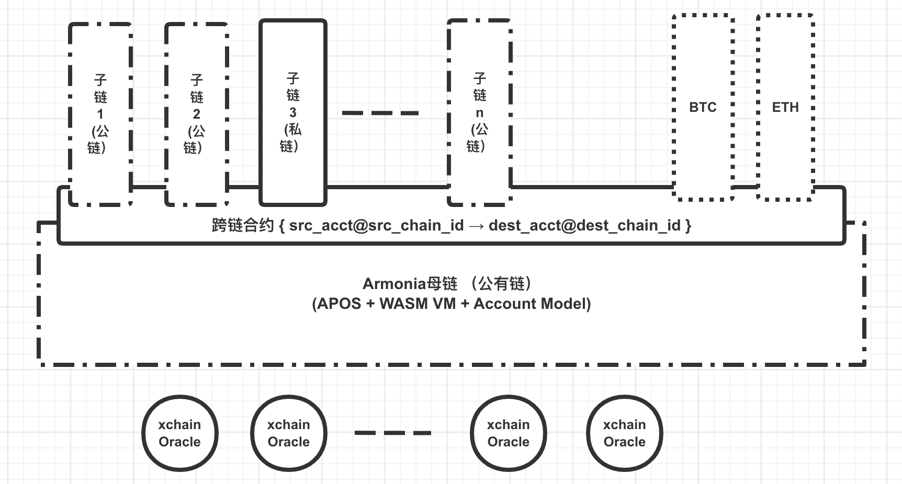

**Core design**：
- `AMC` adopts an innovative consensus algorithm called `APOS` and high-performant WASM virtual machine and requires extremely low transaction cost. `AMC` also adopts account name instead of address based onchain addressing model;
- `ACC` chains can be built with layer-0 & layer-1 template modules in a very quick manner;
- Other public chains like Bitcoin or Ethereum can be also included into the multichain environment to co-exist with other `ACC` chains;
- All chains within Armonia multichain environment can mirror or bridge their assets from one to another;
  
### Multichain model

With Armonia's layer-0 and layer-1 template software and SDK, one can rapidly build many versatile child chains that can have their uniqueness in consensus algorithm, block interval, virtual machine and finality choices...etc, so that they can meet various needs from the ecosystem.

Armonia Child Chain or `ACC` can have their own native tokens or directly utilize `AMAX` which can be bridged from `AMC` chain. It is highly encouraged to implement `ACC` that runs on a gas model and utilizes `AMAX` for gas or transaction fees payment. In this way, all `ACC` chains will help to add values to `AMC` and thus the entire ecosystem.

Basically every single blockchain can be highly abstracted or characterized as a capital letter T: the horizontal line stands for all transaction and block data which will be broadcasted throughout the network; the vertical line by contrast represents the state database (which includes account balance state) that will be only constructed after execution of transactions produced from the horizontal line. Further more, dotted line circle is to represent an open and public blockchain network while solid line circle is for private blockchains）`AMC` can serve as trust anchor to all other `ACC` chains which altogehter form the following multichain universe：

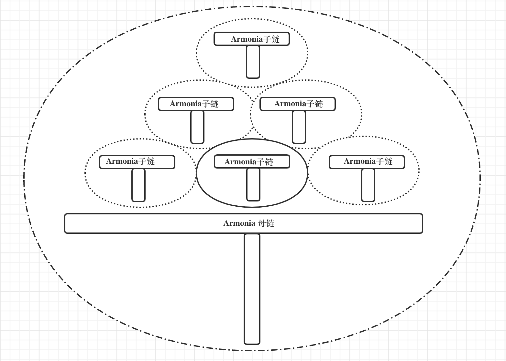

### Multichain layered architecture

Armonia multichain system can be layered as follows:
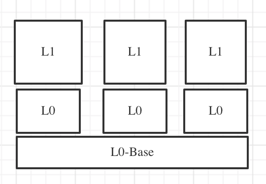

In this design, Armonia will provide layer-0 base component to service the transcation routing capability, which means all node software can listen to a common network port for various single chains but the transcation routing component will determine whether or not the arriving transactions will be further processed in the upper layer of the node software. Through this destination chain filtering process, transactions can have one-to-one, one-to-many and one-to-all modes of accessbility to all chains within Armonia network.

Furthermore, Armonia will also provide layer-0, layer-1 template components and their corresponding SDK such that ecosystem developers can quickly implement a blockchain system by choosing the ready blockchain building blocks with personalized configurations for each chain. In so doing, all child chains can easily interact with each other.

### Multichain transaction routing

As the common building block for layer-0 in Armonia SDK, it serves to support three types of transaction routing in Armonia multichain system: 1) unicast; 2) groupcast; 3) broadcast:
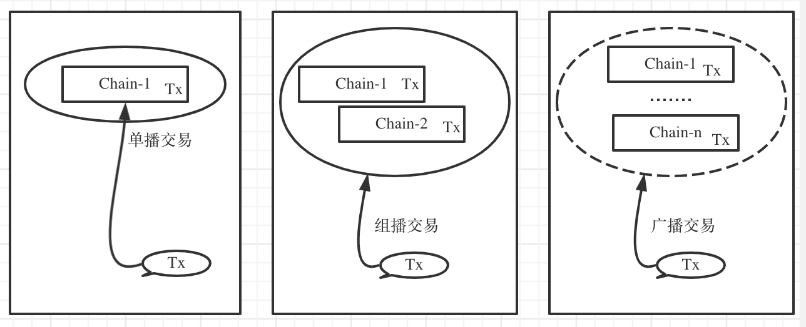

That means, one user can intiate a blockchain transaction that can reach one single chain or a group of prescribed chains or even to every chain within Armonia multichain network. That may be helpful or even critical in a coordinated operation in the multichain network. But of course when there is any chain-level issue like lack of gas fees that could still cause the transaction execution failure, which could create an inconsistent behavior for various chains being targeted by the transaction and this problem has to be addressed rather at the application level.

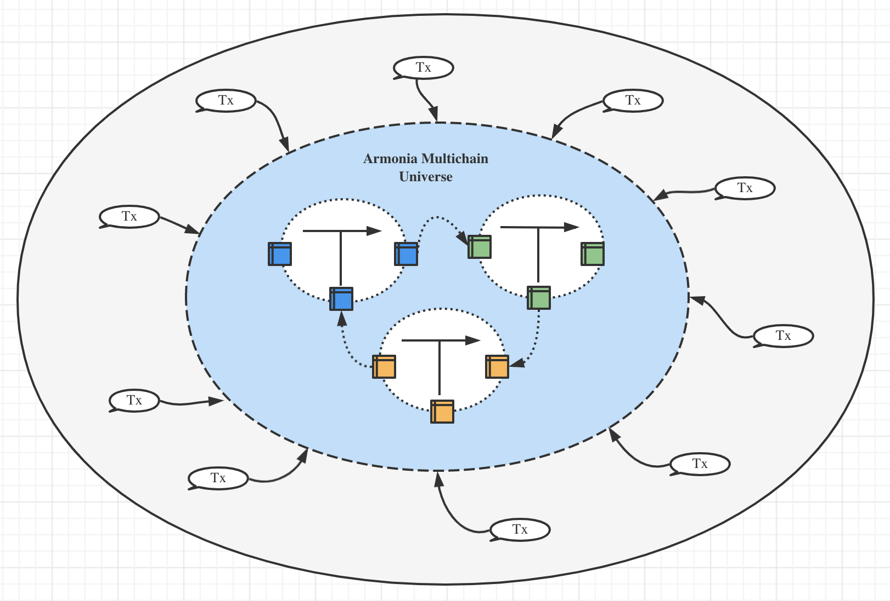

### Multichain enabled applicaiton scenariors
In Armonia's multichain empowered ecosystem, numerous application scenarios can be built including the following:
- issue, mint, transfer and exchange all sorts of crypto assets in `AMC` chain;
- build incentive mining pools in `AMC` to promote Armonia ecosystem development;
- complete KYC/KYB for `AMC` accounts in order to access those smart contracts that have regulation compilance requirements;
- create one or mulitple DEX `ACC` chains to support order-book based exchange with high-performance and low-laytency capabilities;
- create one or multiple prediction `ACC` chains to achieve both performance and privacy;
- create one or mulitple GameFi, NFT and metaverse application chains;

### Cross-chain in Armonia's multichain universe

With multiple chains co-existing in Armonia's multichain universe, there will be interaction i.e. cross-chain activities between `AMC` and `ACC` chains as well other public chains like bitcoin and ethereume. Armonia endeavors to build following cross-chain capability for blockchain users:

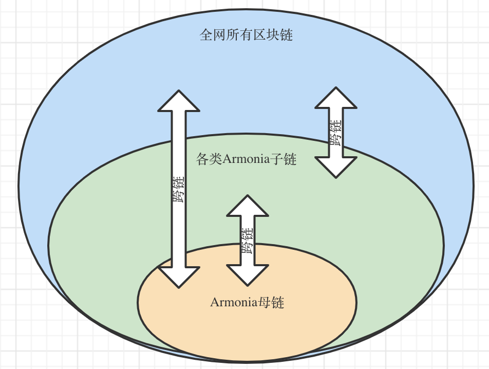

### Cross-chain mechanism

In Armonia's multichain universe, the ability of "moving" an asset from one chain to another can be critical for many users or asset owners. If the originating asset resides in its home chain whereby the assets are issued from, "moving" the asset means locking an asset in the oringating chain and minting the assets from the destination chain and trasferring the assets to the desginated account. But if the orignating asset resides in non-native chain, "moving" the asset means destroying or burning the asset from the originating chain and unlocking the asset and sending back to the designated account from the home chain to the asset. This two-way moving activities that happen between either two chains within Armonia's multichain universe are so-called cross-chain transactions. 

Through cross-chain tranasctions, asset owner can move asset from one chain to another, which greatly increase the liqudity and usability of the asset. Meanwhile, it can suffice all kinds of application scenarios that are happening in the entire ecosystem.

However, following problems must be solved in order to achieve bi-directionary, reliable and efficient cross-chain transactions:
- how to ensure the finality of asset moving transactions onchain?
- how to synchronize the asset moving result from one chain to another?
- how to ensure transactions invovled in cross-chain workflow are effective and accurate?
- how to prevent malicous users from stealing away the asset during the cross-chain transactions?
- how to prevent the mirroring asset from being overly inflated?
  
At the same time, one important question that remains to be answered is:
How to come up a simple-to-use and unified cross-chain solution that can work with all kinds of blockchain in Armmonia's multichain universe?

By addressing the above problems，one hybrid and reliable cross-chain solution has been proposed as follows:

**Legend**:
| Item | Symbol | 
| ---- | ---- |
| Armonia Meta Chain | `M` |
| Asset originating chain | `A` |
| Asset destination chain | `B` |
| cross-chain user | `BU` |
| cross-chain operator | `BO` |
| cross-chain asset | `AS` |
| DAO for asset-mirrored chain | `DAO` |

Note: Distribution of assets from `A` chain has been determined by its consenus mechanism, tokenomics and ecosystem. Howver, asset to be mirrored to its destination chain `B` must be managed within a `ERC20` token contract for its issue, mint, transfer and burn etc activities and these will be governed by its `DAO` body.

* Preparation work
1. Deploy a smart contract `amax.xswap` onto `M` chain for cross-chain management;
2. Deploy a smart contract `as_custody` onto `A` chain to lock cross-chain assets;
3. Deploy a smart contract `as_erc20` onto `B` for issuing, minting and destroying mirrored assets, governed by its DAO body.

* Workflow
1. `BO` approaches `DAO` and request for briding assets from `B`, say 1 mn `AS` and sends them into `as_custody`. Then `DAO` mints 1 mn AS from `as_erc20` and transfer them to `BO`;
2. `BO` places orders on `amax.xswap` with `$AMAX` as escrow that is locked into the same contract;
3. `BU` finds the orders from `amax.xswap` they want to take and they can take them partially or whoely;
4. `BU` sends `AS` from `A` chain to `BO`'s account and posts its transaction ID to `amax.xswap` as a matter of payment proof;
5. `BO` sends `AS` from `B` chain to `BU`'s account upon notification of order status change and close the order with `BU`'s confirmation;
   
Note:
1. when there's any dispute about swap orders, `DAO` will be invovled to do the arbitrage to ensure the complete clousure of the orders;
2. `AMC` can be also `A` or `B` chain.

The detailed workflow diagram:

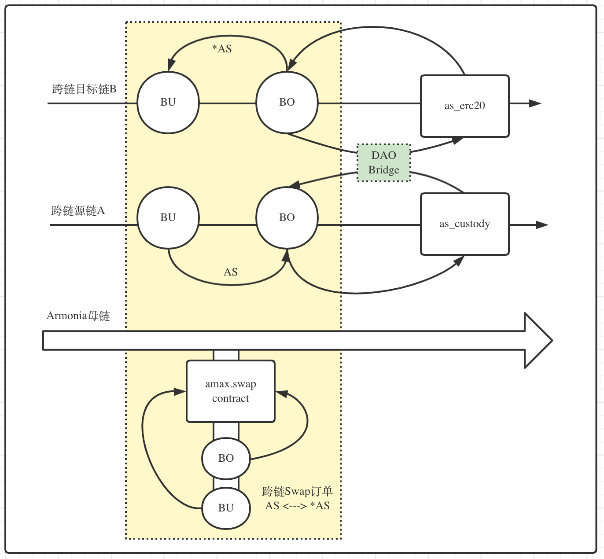

## Armonia Meta Chain

### Basic profile

| Feature | Description | Memo |
|---|---|---|
| Native token | `AMAX` | issued in system contract: **amax.token** |
| Precision | 8 | the smallest unit is 1 of 100 million |
| Total supply | 1,000,000,000 | Inflate/deflate via DAO to support ecossytem advancement |
| Consenus algorithm | APOS | Armonia's DPOS |
| Virtual machine | WASM | High-performing VM |
| anti-sybil attack | resource staking and leasing model with `$AMAX`| zero gas fees | 
| Block interval | 1 sec | a fine choice between stability and transaction onchain speed |
| TPS | 5000+ | benchmarked with transfer transaction, `v1.0` |

### Consensus algorithm

As the founding chain in Armonia's multichain network, `AMC` serves as the trust anchor and value engine to all other spawned child chains. For those who adopt `$AMAX` as the native token of their own chains for basic functions like transaction fees. Hence, it is crticial to ensure the security and reliability of Armonia meta chain. It means there should be a sufficient level of decentralization and anti-censoship capability as described as follows:

1. There should be enough copies of blockchain data maintained by mining nodes such that even if there were direct attacks to the mining nodes the network can still survive and operate and eventually return to a good working state;
2. When there were vicious nodes trying to sabotage the network, the activities can be discovered and even corrected as long as the total number of bad actors are below 1/3 of the total set of validators;
3. Those mining nodes can be replaced by standby nodes when they are not on their duty.

Armonia has invented a new consensus algorithm which is named as Armonia DPOS or short as APOS for `AMC` chain, the mother chain and the other child chains can adopt their own consensus algorithm to secure their network.

The constructs of APOS is as follows:
1. All network nodes that run `AMC` node software can participate in block production for both main and vice blocks that form `AMC` main and backup chain(s);
2. Those nodes that are elected through a non-stop voting process and ranked top `21` in the list become the mainnode and the rest `10,000` nodes are the backup nodes; 
3. The voting process requires the candidate nodes to stake a certain amount of `AMAX` tokens in order to receive votes from the Armonia community; 
4. The other nodes neither in the main nor backup node list are called observer nodes;
5. The main nodes take turns according to VRF algorithm to produce the main blocks and receive newly inflated `AMAX` tokens;
6. The backup nodes also take turns accoring to VRF algorithm but are applied in a much larger quorum (10,0000 nodes for one backup chain) and each backup block mined will reward the miner a certain amount of `AMAX` tokens; the backup block must refer to the latest main block being produced by the main node.
7. The main nodes shall include backup blocks during generating a main block and will be rewarded for correctly including a good bakup block;
8. When a bad backup block is included into the main block, it will not be accepted by the whole network and thus discarded by other nodes;
9. When a main blocked is missed or faulty, the backup block will repace the main block to become the actual main block and the producer node thus receives main block reward;
10. The finality of main blocks is determined through implementation of `aBFT` algorithm. However the finality of backup blocks are determined by the main blocks;
11. Transactions with main blocks must be not only verified but also executed to update the corresponding global state for the network; However, the backup blocks are only required to be verified in order to be accepted by the whole network. This way it avoids the double-spending problem and allows for the nodes to conduct parallel processing for both main and backup blocks;
12. To prevent those greedy but lazy nodes from cheating the network by producting empty or useless blocks that include useless fabricated transactions, the reward to the backup nodes for producing backup blocks will be corresponding to the simliarity of block transactions compared to those in the main blocks at the same height. Therefore, it also means the reward will be only calculated and settled in the next block height;

The interwoven main and backup `AMC` chains can have following block generation scenariors:

- In general the main and backup blocks are interwoven as following:
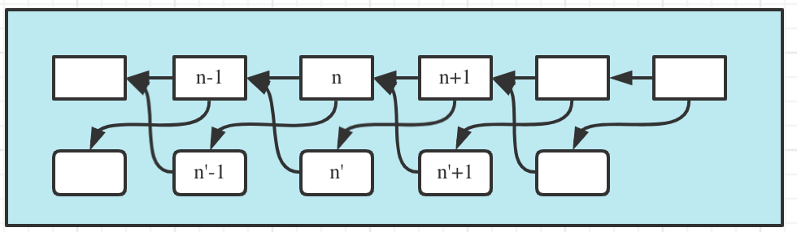

- One Armonia main node produces 6 blocks in a row before shifting to other main nodes but backup nodes shift each time after producing only one backup block:
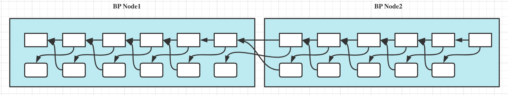

- If the on-duty backup node couldn't produce the block of a timeslot, the next main block won't include the backup block:
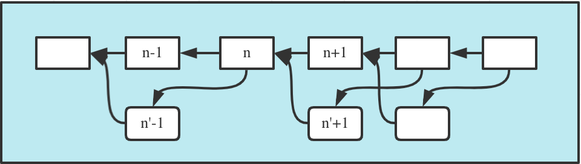

- If the on-duty main node couldn't produce the block of a timeslot, the next (`n+1`) main block will take the current backup block as the main block and its producing node will be rewarded with main block reward amount. However the prior (`n'-1`) backup block will be thus not rewarded as no main block is including it:
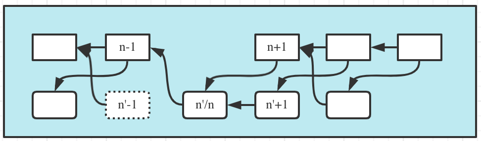

To summarize, for `AMC` chain, it can be composed of one main chain and one to several backup chains that involves in total `21 + 10,000 * n` number of mining nodes. Unlike a pure DPOS consensus algorithm that rewards cadidate nodes not even running the node software, APOS only rewards those that run the node software, synchronize with the network and actually produce either main or backup blocks. This way, it greatly improves the overall security of `AMC` chain.

With more backup nodes to participate, even though each backup node might get lesser chance to mine a block and thus mine lesser `AMAX`, the overall network security and  and community consensus are enhanced, which would eventually contribute to `AMAX` token value. This would thus encourage more to particate and further increase the awareness of the project. As for the number of backup chains, it can be desided through DAO governance body.

Following diagram demonstrate what `AMC` shall look like with the number of backup chains increases:

Last but not least, voting for mining node election will not start within the first year since its inception as `AMC` chain will be under fast-pace development and upgrade mode. Therefore the orignal 21 main nodes will not yield any new `AMAX` token upon each block production. The voting is expected to be open to the general public after passing `v1.0` milestone and new tokens will only be newly mined/inflated after all staked and voted `AMAX` tokens are more than 5% of the total supply.

### Account

Rather than utilize public-key derived address to denote each account, `AMC` adopts account name based account model. One account can be bound with one to multiple public keys and requires its owner to register/activate itself before any transaction could happen with the account. Each account name is composed of 12 alphanumeric characters ([`1-5`,`a-z`,`.`]) and can be extended to support 24 such characters ([`1-9`,`a-z`,`.`,`#`,`@`]) Account owners must stake a certain amount of `$AMAX` tokens for reserving a ccertain amount of system RAM, CPU and network etc resources in order to particate in all kinds of transactions.

## First Armonia-child-chain
In order to embrace the biggest crypto ecosystem in the current world, Armonia's first child chain will stay 100% comptiable with Ethereum and their cloned chains. Its main features are:

| Feature | Description | Memo |
|---|---|---|
| Native token | `AMAX` | bridged from `AMC` chain |
| Consensus algorithm | PoSA |  |
| Virtual machine | EVM | support solidity language for its smart contract development |
| Anti-sybil attack | Gas for transaction fees, paid in `$AMAX` | `Gas fees = Gas amount x Gas price` |
| Account model | public key derived addresses | Format: `0x...` |
| Block interval | 3 seconds | |
| TPS | 160+ | Bechmarked with transfer transactions, `v1.0` ｜

## Tokenomics

Armonia meta chain has her native token `$AMAX` which is not only a source of power to all activities on `AMC` but can also serve child chains and even become their native token when chosen so by the child chains.

The total supply of `$AMAX` is 1 billion and there's no systematic inflation. But Armonia `DAO` can decide whether to inflate `$AMAX` to make the ecosystem even more successful.

### Token distribution

The overall allocation of `$AMAX` tokens are as follows:

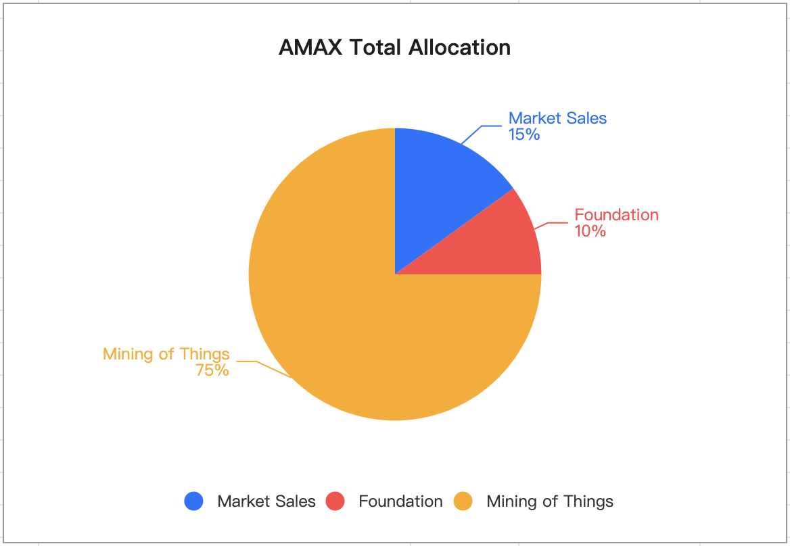

* Market sales allocation
  
 Among the total allocation, `$AMAX` tokens to be used in the market sales occupies 15% of the total amount, which will serve the following purposes:
 * The fund collected can support the project development by Armonia's core team and the `DAO` body;
 * The tokens that are sold to the public can be used to mining node staking and voting to allow for 5% staking ratio for mining activation;

 Among the market sales, there are 2% for seed-round sale, 3% for institutional sale and 10% for `IDO` which will use a bonding curve formula to bind the `$AMAX` price with the total staking amount.

* Armonia Foundation allocation

 In order to support overall health of market capital and `DAO` development, 10% of `$AMAX` will be allocated to Armonia Foundation and kept in `amax.fund` which can be supervised by the entire community and will be only used for advancement of the ecosystem.

* Mining allocation

 In total there'll be 75% of `$AMAX`'s total supply to be used in mining activites within Armonia's ecosystem and it is regarded as "mining of things", meaning every value contributing actitivities in the ecossytem can be in the form of mining and participants can be thus rewarded with tokens including `$AMAX'.

### Mining of Things (MoT)

It is in Armonia's belief that every activity that helps to add value to the entire Armonia ecosystem and community shall be rewarded and mining is a good way to support the activities and rewarding to be conducted in smart-contract based mining pools.

In general following types of mining pools are existing:
|Mining category|Mining Ratio (`$AMAX`)| Description |
|---|---|---|
|Blockchain development Mining | 30% |15%: for achiving milestone development: `v1.0`, `v2.0`和`v3.0`; Afterwards, 15%: `DAO` driven development |
|Main-blocks mining | 5% | halving every 30 months | 
|Backup-blocks mining | 5% | ditto |
|Web3 mining | 10% | to reward those who providing web3 resources |  
|Ecosystem development mining| 25% | any other beneficiary activities to the ecosystem development |

The ecosystem development mining activities can include but are not limited to the following:
- registration of accounts and inviting other users to register their accounts
- provide KYC/KYB service and cerity the accounts onchain
- provide other kinds of oracle services
- cross some main assets over from other well-know blokchains

## Infrasturcture support for We3
To achieve Web3，it means a host of internet services can be built and offered in a decentralized manner as well as metered and compensated with crypto tokens.

Web3 enabling services include but are not limited to the following:
- DFS：Decentralized File Storage
- DCOMP: Decentralized Computing Resources (E.g. VM leasing for application running）
- DNET: Decentralized Networking, including traffic distribution/forwarding and routing etc.
- DCDN: Decentralized CDN Service
- DDNS: Decentralized DNS Service
- DID: Decentralized Identity Service

Armonia core team endeavors to build the above list of decentralized web3 services by effectively metering the health and usage of services with `$AMAX` as the main tokens to incentivize all contributors to web3 enablement.

## xDAO governance
In a world of decentralization, not only technologies and products need to be constantly discussed and improved but also the interactions within the entire community need to happen in order to decide how to appropriately incentivize those who contributes and if possible to penalize those who create damages or have done things badly to the ecosystem. All these requires both onchain and offchain activites in an orchestrated manner. It is also paramount important to make sure this type of governance adheres to the decentralization principle by getting all stakeholders within the ecosystem to freely participate by making proposals, voting/approving the proposal and execution both onchain and offchain.

Therefore it is necessary to establish a decentralized autonomous organization or `DAO` to drive the overall development of Armonia ecosystem by steering the technology development and propelling community growth. As there can be infinite amount of topics, projects and efforts to be led by `DAO` bodies, there may be also interactions between these `DAO` bodies to achieve consenus on common topics or objectives. Hence, a top-level `DAO` to lead all other sub-level `DAO` would be very important in guilding the development of `DAO` bodies. The top `DAO` is named as `Armonia xDAO`.

For a `DAO` boday, the common governnance workflow is as follows:

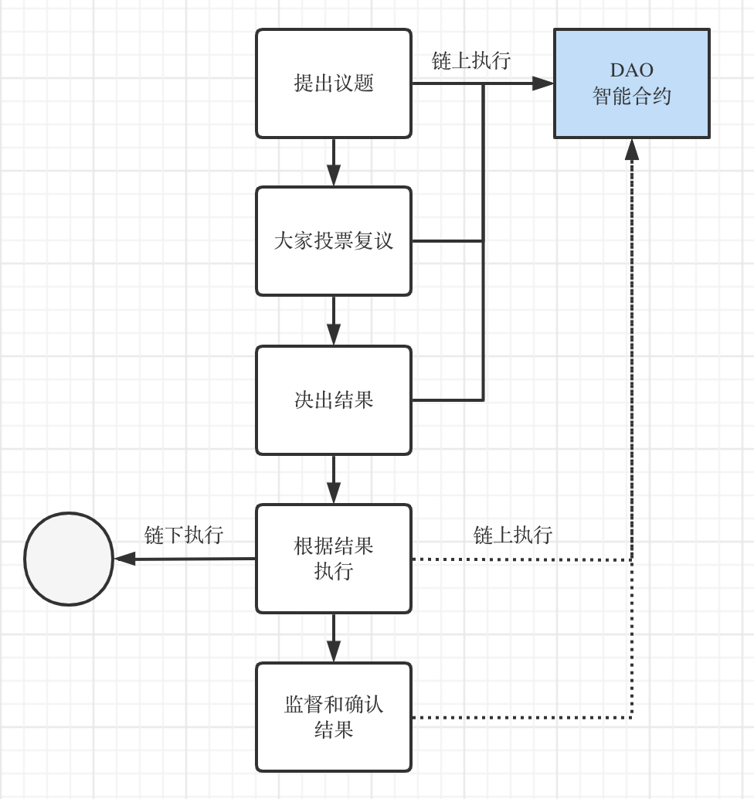

- 其中DAO智能合约由相应DAO组织来实现部署，并开放源码给到DAO组织里面的成员；
- DAO组织里面的成员也需要通过一个招募的过程完成，并通过DAO合约发行的凭证代币获得投票资格；
- DAO成员的投票数量根据DAO合约协议相应发放；
- DAO组织里面的成员都可以进行某个事项的提议，包括完成复议的奖励金额提议，可以是个人提供也可以是DAO组织提供
- DAO成员参与复议投票，可以有具体的投票截止时间，按照一币一票等规则；
- 计票后根据该轮选择的决策规则，来判定提议是否通过；
- 如果提议通过，则通过指定的执行人来完成提议的执行；
- DAO组织最后检查执行结果并完成该提议的最终状态为结束
  
Armonia里面的一些基本DAO有如下：
- 开发者DAO：负责公链开发驱动，包括功能提议实现修改和发布，并提供激励和审核机制；
- 节点DAO：负责挖矿节点之间的协调，整个区块链网络的安全保障议题事项的落实，备链挖矿的决议等；
- AMAX代币DAO：AMAX的发行和分配、机制；
- 万物挖矿：包括各项新的矿池的开设和关闭、激励来源和执行；
  
## Technology roadmap

Technology roadmap:
- v1.0：实现多链系统的母链和第一条EVM子链的搭建和部署，母链实现APOS共识机制，双向跨链实现;
- v2.0：实现生态内开放式的web3资源共享挖矿机制和相应web3的访问技术对接;
- v3.0：实现多链的L0-base，L0, L1的模块化和模板化SDK，可以快速搭建生态内各类单链.

在实现v3.0之后的技术路线图，必将由`developer dao`来全面驱动和治理实现完成。

## Reference
- metaverse: https://theconversation.com/the-metaverse-is-money-and-crypto-is-king-why-youll-be-on-a-blockchain-when-youre-virtual-world-hopping-171659
- DPOS: https://steemit.com/dpos/@dantheman/dpos-consensus-algorithm-this-missing-white-paper
- aBFT: https://hedera.com/learning/what-is-asynchronous-byzantine-fault-tolerance-abft
- VRF: https://en.wikipedia.org/wiki/Verifiable_random_function
- DAO: https://consensys.net/blog/blockchain-explained/what-is-a-dao-and-how-do-they-work/
- finality：https://academy.binance.com/en/glossary/finality