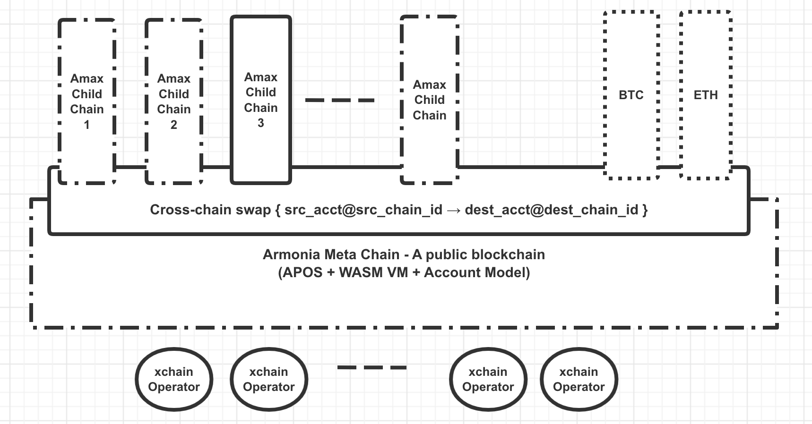
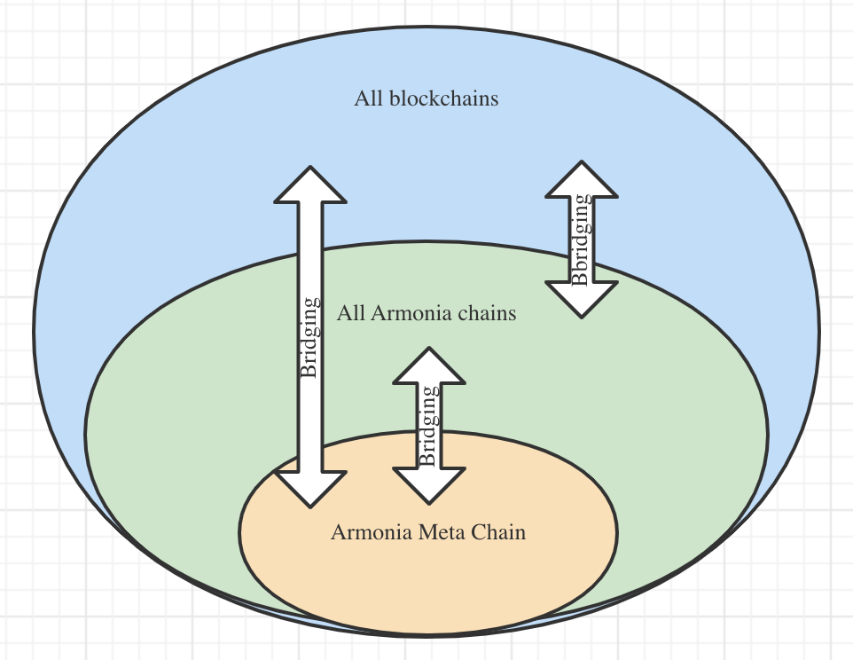
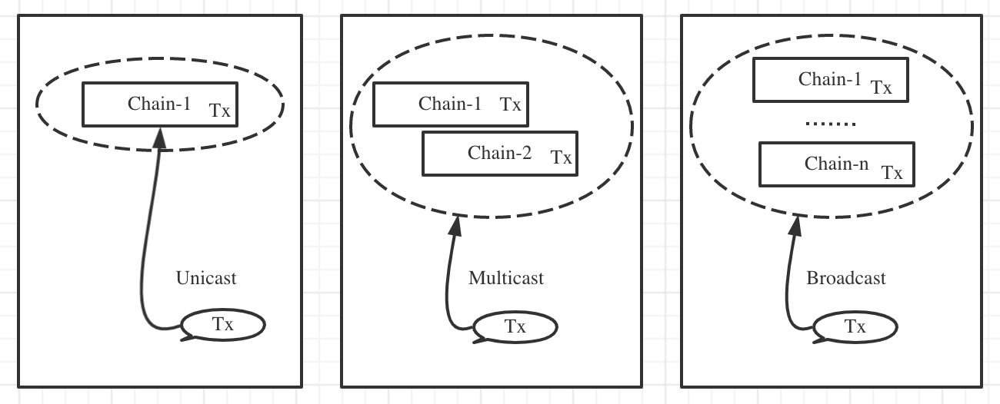
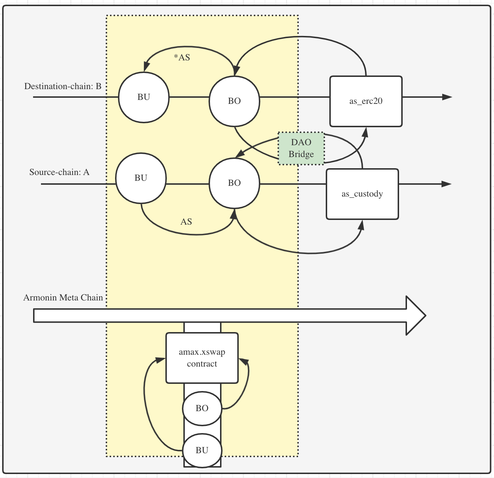
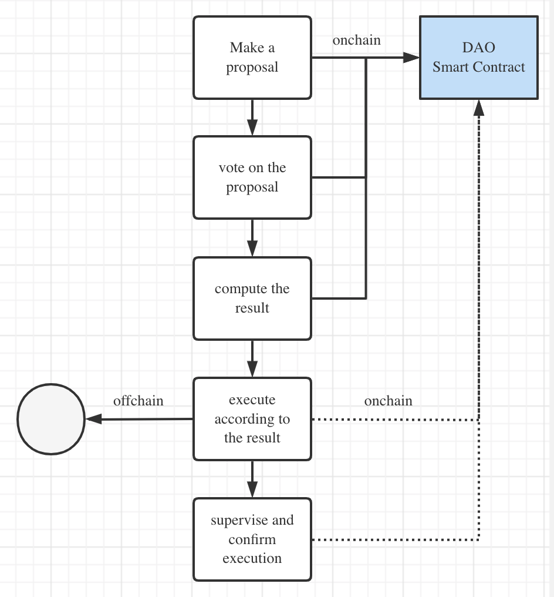

# Armonia multichain blockchain platform

> Building a platform of mother-and-children multichain
`v0.5`

- [Armonia multichain blockchain platform](#armonia-multichain-blockchain-platform)
  - [Introduction](#introduction)
  - [Objectives & principles](#objectives--principles)
  - [Overall architecture](#overall-architecture)
    - [Multichain model](#multichain-model)
    - [Multichain layered architecture](#multichain-layered-architecture)
    - [Multichain transaction routing](#multichain-transaction-routing)
    - [Multichain enabled application scenarios](#multichain-enabled-application-scenarios)
    - [Cross-chain in Armonia's multichain universe](#cross-chain-in-armonias-multichain-universe)
    - [Cross-chain mechanism](#cross-chain-mechanism)
  - [Armonia Meta Chain](#armonia-meta-chain)
    - [Basic profile](#basic-profile)
    - [Consensus algorithm](#consensus-algorithm)
    - [Account](#account)
  - [First Armonia-child-chain](#first-armonia-child-chain)
  - [Tokenomics](#tokenomics)
    - [Token distribution](#token-distribution)
    - [Mining of Things (MoT)](#mining-of-things-mot)
  - [Infrastructure support for Web3](#infrastructure-support-for-web3)
  - [xDAO governance](#xdao-governance)
  - [Technology roadmap](#technology-roadmap)
  - [Core team](#core-team)
  - [Reference](#reference)
## Introduction
To address growing user application needs, blockchain technology has evolved distributed ledger, to smart contract technology that supports all sorts of application logic, through to providing layer-0 and layer-1 SDK technology for quickly building new blockchains, and building layer-2 to solve problems that couldn't be solved with layer-1 technology, as well as bi-directional cross-chain technology.

However, to date, other than promoting security, reliability and decentralization, there hasn't been a single blockchain technology that can sufficiently meet the following requirements:
- massively parallel processing;
- modularized and extensible; and
- customizable and configurable
  
Armonia's founding team believes it takes a multichain blockchain platform technology to achieve the above objectives, which can then service every individual and business user globally. It is also Armonia's founding team's belief that the to-be-built metaverse will be a truly decentralized, open and multi-chain universe which harbors users, assets, transactions and smart-contract based, mission-critical DApps.

## Objectives & Principles
Armonia is a mother-child multichain blockchain platform, wherein there's Armonia Meta Chain (`AMC`) which is the mother chain to all other sovereign Armonia Child Chains (`ACC`). Armonia Meta Chain is designed to be highly secure, highly performant chain with very low even zero transaction fees. It also supports inter-blockchain bridging and mirroring of assets in order to support numerous DAPPs to be built on top of the platform. Under a multichain architecture, Armonia is poised to support at least one billion users worldwide.

**Core objectives**
- To build a unified account and transaction addressing/routing system for the entire Armonia multichain universe;
- `AMC` to provide a native token `$AMAX`, which will serve as the foundational value engine and trust anchor of the entire multichain based ecosystem；
- To provide layer-0 and layer-1 blockchain template implementations and SDK to enable rapid blockchain creation and deployment for vertical application domain specific child chains that can inter-operate with `AMC` freely for asset mirroring and bridging;
- `ACC` chains can be homogeneous chains or heterogeneous chains, public chains, private chains or alliance chains, etc., which can have their own choices and formation of consensus algorithm, virtual machine, block interval, finality and permission scope, etc. that determine a unique blockchain system；
- After registering and staking escrow via `AMC` chain, all distributed Internet resources (including distributed file storage, computing and networking, etc.) can be easily accessed and accurately metered. There will be various onchain charging models and open markets for all web3.0 resources available throughout the Armonia network. The Armonia multichain platform can therefore become the cornerstone of the metaverse.

**Design principles**
- Secure and reliable：to ensure `AMC` has a characteristic of being highly decentralized. Any malicious activities can be detected, corrected and penalized, if not avoided on a timely basis. Therefore, all assets onchain can be safely guarded；
- Extensible：through modularized "lego-style" building blocks, Armonia's blockchain system can be combinable, replaceable and extendable;
- High performance：`AMC` can achieve 5000+ TPS and generate blocks at 1 second intervals. In addition, through utilizing multiple `ACC` chains, transactions can be grouped or segregated into different `ACC` chains to further achieve sharding effects and acquire massive parallel processing speed. As the total number of `ACC` chains can be infinite, the overall performance would thus also be infinite.
- Personalized: the characteristics of the `ACC` chains can be tailored, whereby Armonia's multichain platform can support infinite kinds of demands from the over-laying ecosystem; and
- Simply：as long as users core objectives can be met, Armonia’s multichain platform avoids any form of over-design or over-implementation to ensure the entire network maintains its overall security, reliability and agility.

## Overall architecture
As a multichain platform, Armonia has adopted a unique mother-child-chain model，as compared to star-like models which have been adopted in many other multichain technologies like Cosmos or Polkadot：

**Core design**
- `AMC` adopts an innovative consensus algorithm called `APOS` and high-performance WASM virtual machine, requiring extremely low transaction cost. `AMC` also adopts account name instead of address based onchain addressing model;
- `ACC` chains can be built with layer-0 and layer-1 template SDK modules in a very quick manner, the ACC chains can be either homogeneous or heterogeneous;
- Other public chains like Bitcoin or Ethereum can also be included in the multichain environment to co-exist with other `ACC` chains; and
- All chains within the Armonia multichain environment can mirror or bridge their assets from one to another.
  
### Multichain model

With Armonia's layer-0 and layer-1 template software and SDK, users can rapidly build many versatile child chains with their uniqueness in consensus algorithm, block interval, virtual machine and finality choices, etc., to meet the various needs of the ecosystem.

`ACC` can have their own native tokens or directly utilize `$AMAX` which can be bridged from the `AMC` chain. It is highly encouraged to implement `ACC` that runs on a gas model and utilizes `$AMAX` for gas or transaction fee payment. By increasing the demand of $AMAX, `ACC`s will help to add value to `AMC`, even the entire ecosystem.

Basically, every single blockchain can be highly abstracted or characterized as the capital letter T whereby the horizontal line stands for all transaction and block data broadcasted throughout the network and the vertical line represents the state database (for example, account balance state) that will only be constructed after execution of transactions produced from the horizontal line. Furthermore, a dotted line circle is to represent an open and public blockchain network while a solid line circle stands for private blockchain. `AMC` can serve as trust anchor to all other `ACC` chains which all together, they form the following multichain universe：

### Multichain layered architecture

Armonia multichain system can be layered as follows:

In this design, Armonia will provide layer-0 base components to service the transaction routing capability, which means all node softwares can acquire information from a common network port for various single chains but only the transaction routing components can determine whether or not the arriving transactions will be further processed in the upper layer of the node software. Through this destination chain filtering process, transactions can have one-to-one, one-to-many and one-to-all modes of accessibility to all chains within the Armonia network.

Furthermore, Armonia will provide layer-0, layer-1 template components and their corresponding SDK so that ecosystem developers can quickly implement a blockchain system by choosing the ready blockchain building blocks with personalized configurations for each chain. In doing so, all child chains can easily interact with each other.

### Multichain transaction routing

As the common building block for layer-0 in Armonia SDK, it serves to support three types of transaction routing in the Armonia multichain system: 1) unicast; 2) multicast; 3) broadcast:

It means that one user can intiate a blockchain transaction that can reach one single chain or a group of prescribed chains or even every chain within Armonia multichain network. This routing capability can be useful or even critical in some coordinated operations in the multichain network. Notwithstanding the foregoing, when there is any chain-level issue like lack of gas fees that causes transaction failure, some inconsistencies among chains could be thus incurred. But this problem can be easily addressed at an application level like resending a transaction multiple times just to ensure its delivery and it shall have no harm onchain at all due to the idempotency nature of tranascations. 

### Multichain enabled application scenarios
In Armonia's multichain empowered ecosystem, numerous application scenarios can be built, including the following:
- issue, mint, transfer and exchange all sorts of crypto assets in `AMC` chain;
- build incentive mining pools in `AMC` to promote Armonia ecosystem development;
- complete KYC/KYB for `AMC` accounts in order to access smart contracts that have regulation compliance requirements;
- create one or multiple DEX `ACC` chains to support order-book based exchanges with high-performance and low-latency capabilities;
- create one or multiple prediction `ACC` chains to achieve both performance and privacy; and
- create one or multiple GameFi, NFT and metaverse application chains;

### Cross-chain in Armonia's multichain universe

With multiple chains co-existing in Armonia's multichain universe, there will be interaction i.e. cross-chain activities between `AMC` and `ACC` chains as well as other public chains like Bitcoin and Ethereum. Armonia endeavors to build following cross-chain capabilities for blockchain users:

### Cross-chain mechanism

In Armonia's multichain universe, the ability of "moving" an asset from one chain to another can be critical for asset owners. If the originating asset resides in its home chain whereby the assets are issued from, "moving" the asset means locking an asset in the oringating chain and minting the assets from the destination chain and trasferring the assets to the desginated account. However, if the orignating asset resides in non-native chain, "moving" the asset means destroying or burning the asset from the originating chain, unlocking the asset and sending the designated account from the home chain to the asset. This two-way moving activities that happen between any two chains within Armonia's multichain universe are cross-chain transactions. 

Through cross-chain transactions, asset owner can move an asset from one chain to another, which greatly increases the liquidity and usability of the asset. This flexibility can help satisfy all kinds of application scenarios that happen in the entire ecosystem.

However, the following problems must be solved to achieve bi-directional, reliable and efficient cross-chain transactions:
- how to ensure the finality of the asset-moving transactions onchain?
- how to synchronize the asset transferring or locking result from one chain to another?
- how to ensure transactions involved in cross-chain workflow are effective and accurate as expected?
- how to prevent malicious users from stealing the assets during the cross-chain transactions?
- how to prevent the mirroring asset from being overly inflated?
  
At the same time, one important question that remains to be answered is:
How to establish a simple-to-use and unified cross-chain solution that can work with all kinds of blockchain in Armonia's multichain universe?

In addressing the above problems, one hybrid and reliable cross-chain solution has been proposed as follows:

**Legend**:
| Item | Symbol | 
| ---- | ---- |
| Armonia Meta Chain | `M` |
| Asset originating chain | `A` |
| Asset destination chain | `B` |
| Cross-chain user | `BU` |
| Cross-chain operator | `BO` |
| Cross-chain asset | `AS` |
| DAO for asset-mirrored chain | `DAO` |

Note: Distribution of assets from chain `A` has been determined by its consensus mechanism, tokenomics and ecosystem. However, asset to be mirrored to its destination chain `B` must be managed within an `ERC20` token contract for its issuing, minting, transferring, burning, etc. and these activities will be governed by its `DAO` body.

* Preparation work
1. Deploy a smart contract `amax.xswap` onto chain `M`  for cross-chain management;
2. Deploy a smart contract `as_custody` onto chain `A`  to lock cross-chain assets;
3. Deploy a smart contract `as_erc20` onto `B` for issuing, minting and destroying mirrored assets, governed by its DAO.

* Workflow
1. `BO` approaches `DAO`, requests bridging assets from `B`, say 1 mn `AS`, and sends them into `as_custody`. Then, `DAO` mints 1 mn AS from `as_erc20` and transfers them to `BO`;
2. `BO` places orders on `amax.xswap` with `$AMAX` as escrow that is locked into the same contract;
3. `BU` finds the orders they want to take from `amax.xswap` and they can either take the orders partially or entirely;
4. `BU` sends `AS` from chain `A`  to `BO`'s account and posts its transaction ID to `amax.xswap` as payment proof;
5. `BO` sends `AS` from chain `B`  to `BU`'s account upon notification of order status change and closes the order with `BU`'s confirmation;
   
Note:
1. when there's any dispute about swap orders, `DAO` will be involved to do the arbitrage to ensure the complete closure of the orders;
2. `AMC` can also be `A` or `B` chain.

The detailed workflow diagram:

## Armonia Meta Chain

### Basic profile

| Feature | Description | Notes |
|---|---|---|
| Native token | `$AMAX` | Issued in system contract: **amax.token** |
| Precision | 8 | The smallest unit is 1 of 100 million |
| Total supply | 1,000,000,000 | Inflate/deflate via DAO to support ecosystem advancement |
| Consensus algorithm | APOS | Armonia's DPOS |
| Virtual machine | WASM | High-performing VM |
| Anti-sybil attack | resource staking and leasing model with `$AMAX`| Zero gas fees | 
| Block interval | 1 sec | A fine choice to balance stability and transaction onchain speed |
| TPS | 5000+ | Benchmarked with transfer transaction, `v1.0` |

### Consensus algorithm

As the founding chain in Armonia's multichain network, `AMC` serves as the trust anchor and value engine to all the other spawned child chains. For those who adopt `$AMAX` as the native token of their own chains for basic functions like paying transaction fees, it is critical to ensure the security and reliability of Armonia meta chain. It means sufficient decentralization and anti-censorship capability is needed, as follows:

1. There should be enough copies of blockchain data maintained by mining nodes so that even if the mining nodes are under direct attack, the network can still survive, operate and eventually return to stable working state;
2. When there are vicious nodes trying to sabotage the network, the activities can be discovered and even corrected as long as the total number of bad actors is below 1/3 of the total set of validators; and
3. Those mining nodes can be replaced by standby nodes when they are off-duty.

Armonia has developed a new consensus algorithm, named as Armonia DPOS, or short for APOS, for `AMC` chain, the mother chain and the other child chains can adopt their own consensus algorithm to protect their network.

The core framework of APOS is as follows:
1. All network nodes that run `AMC` node software can participate in block production for both main and blocks that form `AMC` main and backup chain(s);
2. The nodes elected through a non-stop voting process and rank top `21` in the list become the main nodes and the remaining `10,000` nodes are the backup nodes; 
3. The voting process requires the candidate nodes to stake a certain amount of `$AMAX` tokens in order to receive votes from the Armonia community; 
4. The other nodes neither in the main nor backup node list are called observer nodes;
5. The main nodes take turns according to VRF algorithm to produce main blocks and receive newly inflated `$AMAX` tokens;
6. The backup nodes also take turns according to VRF algorithm but are applied in a much larger quorum (10,000 nodes for one backup chain) and each backup block mined will reward the miner a certain amount of `$AMAX` tokens. The backup block must refer to the latest main block being produced by the main node;
7. The main nodes shall include backup blocks during generating a main block and will be rewarded for correctly including a good backup block;
8. When a bad backup block is included in the main block, it will not be accepted by the whole network and thus discarded by other nodes;
9. When a main block is missing or faulty, the backup block will replace the main block to become the actual main block and the producer node thus receives the main block reward;
10. The finality of main blocks is determined through implementation of `aBFT` algorithm. However, the finality of backup blocks is determined by the main blocks;
11. Transactions with main blocks must be not only verified but also executed to update the corresponding global state for the network, while the backup blocks are only required to be verified in order to be accepted by the whole network. In this way, it avoids double-spending problem and allows for the nodes to conduct parallel processing for both main and backup blocks; and
12. To prevent greedy but lazy nodes from cheating the network by producing empty or useless blocks that include useless fabricated transactions, reward to the backup nodes for producing backup blocks will correspond with the similarity of block transactions compared to those in the main blocks at the same height. Therefore, the reward will only be calculated and settled in the next block height;

The interwoven main and backup `AMC` chains may have the following block generation scenarios:

- In general the main and backup blocks are interwoven as follows:

- One Armonia main node produces 6 blocks in a row before shifting to other main nodes. But backup nodes shift each time after producing only one backup block:

- If the on-duty backup node is unable to produce the block of a timeslot, the next main block won't include the backup block:

- If the on-duty main node is unable to produce the block of a timeslot, the next (`n+1`) main block will take the current backup block as the main block and its producing node will be rewarded with the amount of main block reward. However, the prior (`n'-1`) backup block won't be rewarded as no main block is included:

To summarize, for `AMC` chain, it can be composed of one main chain and zero to several backup chains that includes in total `21 + 10,000 * n` number of mining nodes. Unlike a pure DPOS consensus algorithm that rewards candidate nodes that don't run the node software, APOS only rewards those that run the node software, synchronize with the network and actually produce main or backup blocks. This way, it greatly improves the overall security of the `AMC` chain.

With more backup nodes to participate, even though each backup node might get a reduced chances to mine blocks and thus mine fewer `$AMAX`, the overall network security and community consensus will be enhanced, which would eventually contribute to `$AMAX` token value. This would encourage more users to particate and further increase the awareness of the project. As for the number of backup chains, it can be decided by DAO governance mechanism.

The following diagram depicts what `AMC` shall look like with the number of backup chains increasing:

Vote for mining node election will not start in the first year since its inception as `AMC` chain will be under fast-pace development and will upgrade its mode. Therefore, the original 21 main nodes will not yield any new `$AMAX` token upon each block production. Voting is expected to be open to the public after passing `v1.0` milestone and new tokens will be minted/inflated after all staked and voted `$AMAX` tokens reach more than 5% of the total supply.

### Account

Rather than utilize a public-key derived address to denote each account, `AMC` adopts an account model based on account name. One account can be bound with from one or multiple public keys and the key requires its owner to register/activate it before any transaction could be made within the account. Each account name is composed of 12 alphanumeric characters ([`1-5`,`a-z`,`.`]) and can be extended to support 24 such characters ([`1-9`,`a-z`,`.`,`#`,`@`]). Account owners must stake a certain amount of `$AMAX` tokens for reserving a certain amount of system RAM, CPU, network and other resources in order to particate in all kinds of transactions.

## First Armonia-child-chain
To embrace the largest crypto ecosystem in the current world, Armonia's first child chain will stay 100% compatible with Ethereum and their cloned chains. Its main features are:

| Feature | Description | Memo |
|---|---|---|
| Native token | `$AMAX` | Bridged from `AMC` chain |
| Consensus algorithm | PoSA |  |
| Virtual machine | EVM | support solidity language for its smart contract development |
| Anti-sybil attack | Gas fees, paid in `$AMAX` | `Gas fees = Gas amount x Gas price` |
| Account model | public key derived addresses | Format: `0x...` |
| Block interval | 3 seconds | |
| TPS | 160+ | Benchmarked with transfer transactions, `v1.0` ｜

## Tokenomics

Armonia meta chain has its native token `$AMAX` which is not only a source of power to all activities on `AMC` but can also serve child chains and even become their native token when chosen so by the child chains.

The total supply of `$AMAX` is 1 billion and there won't be any systematic inflation. Armonia `DAO` can decide whether to implement inflation to `$AMAX` for the success of the ecosystem.

### Token distribution

The overall allocation of `$AMAX` tokens are as follows:

* Market sales allocation
  
 Among the total allocation, `$AMAX` tokens to be used in the market sales occupy 15% of the total amount, which will serve the following purposes:
 * The collected fund can support the project development by Armonia's core team and the `DAO` body;
 * The tokens sold to the public can be used to mine node staking and vote to allow 5% staking ratio for mining activation;

 Among the market sales, 2% is for seed-round sale, 3% for institutional sale and 10% for `IDO` which will use a bonding curve formula to bind the `$AMAX` price with the total staking amount.

* Armonia Foundation allocation

 In order to support overall health of market capital and `DAO` development, 10% of `$AMAX` will be allocated to Armonia Foundation and kept in `amax.fund` which can be supervised by the entire community and will only be used for advancement of the ecosystem.

* Mining allocation

In total, there'll be 75% of `$AMAX`'s total supply used in mining activities within Armonia's ecosystem and it is regarded as "mining of things", meaning all value contributing to activities in the ecosystem can take the form of mining and participants can be rewarded with tokens including `$AMAX'.

### Mining of Things (MoT)

It is in Armonia's belief that every value-added activity to the Armonia ecosystem and community shall be rewarded. Mining to be conducted in smart-contract based mining pools is a good mechanism to support the activities.

In general, following types of mining pools exist:
|Mining category|Mining Ratio (`$AMAX`)| Description |
|---|---|---|
|Blockchain development mining | 30% |15%: for achieving milestone development: `v1.0`, `v2.0` and `v3.0`; Afterwards, 15%: `DAO` driven development |
|Main-blocks mining | 5% | Halving every 30 months | 
|Backup-blocks mining | 5% | Ditto |
|Web3 mining | 10% | To reward those who provide web3 resources |  
|Ecosystem development mining| 25% | Any other beneficiary activities to the ecosystem development |

The ecosystem development mining activities include but are not limited to the following:
- registration of accounts and invitation to other users to register their accounts;
- provide KYC/KYB service and verify the accounts onchain;
- provide other kinds of oracle services; and
- transfer main assets from other well-known blockchains.

## Infrastructure support for Web3
To achieve Web3，a host of internet services can be built and offered in a decentralized manner as well as metered and compensated with crypto tokens.

Web3 enabling services include but are not limited to the following:
- DFS：Decentralized File Storage
- DCOMP: Decentralized Computing Resources (E.g. VM leasing for application running）
- DNET: Decentralized Networking, including traffic distribution/forwarding and routing, etc.
- DCDN: Decentralized CDN Service
- DDNS: Decentralized DNS Service
- DID: Decentralized Identity Service

Armonia core team endeavors to build the above list of decentralized web3 services by effectively metering the health and usage of services with `$AMAX` as the main tokens to incentivize all contributors to web3 enablement.

## xDAO governance
In a world of decentralization, technologies and products need to be constantly discussed and improved, and the entire community needs to interact in order to decide how to appropriately incentivize those who contributes and if possible, to penalize those who create damages or do bad things to the ecosystem. It requires that both onchain and offchain activities take place in an orchestrated manner. It is of paramount importance to make sure this type of governance adheres to the decentralization principle by getting all the stakeholders within the ecosystem to freely participate by making proposals, voting/approving the proposal and execution both onchain and offchain.

Therefore it is necessary to establish a decentralized autonomous organization or `DAO` to drive the overall development of Armonia ecosystem by steering the technology development and propelling community growth. As there can be infinite amount of topics, projects and efforts to be led by `DAO` bodies, there may also be interactions between these `DAO` bodies to achieve consensus on common topics or objectives. Hence, a top-level `DAO` that leads all the sub-level `DAO` bodies would be very important in guiding the development of `DAO` bodies. The top `DAO` is named as `Armonia xDAO`.

For a `DAO` body, the common governance workflow is as follows:

- `DAO` body deploys the smart contract which is open sourced to all participants;
- Members of `DAO` may be recruited through a certain process and registered with the `DAO` body but the public may also be able to participate in the management activities;
- Members may be distributed with voting tokens according to the governance protocol;
- Any member within `DAO` body can make proposals for particular subjects and allocate the funds to reward those who help fulfill the objectives. The funds may come from the member himself or from the `DAO` treasury reserve;
- All members can vote for the proposals and the voting period is time-controlled. The vote can be one-account-one-vote or one-token-one-vote based;
- There can be equal vote, weighted vote, median vote, etc. types for computing/determining if the proposal or issue is passed; 
- If the proposal is passed, the pre-designated account or member may be required to execute the proposal; and
- `DAO` body may review and confirm the execution result.
  
Following basic `DAOs` will be founded:
- Developer DAO: It guides the blockchain technology development, including blockchain feature upgrade and bug fix, with pre-allocated incentive tokens to reward the contributors;
- Miner DAO: Once `AMC` chain has been activated for inflation, each mined block will contain a certain amount of inflated `$AMAX` token to reward the miners. The miners DAO will coordinate among the miners for ensuring network security. E.g. how many backup chains shall be supported to include as many miners as possible;
- AMAX DAO: to govern the issuance, minting and burning of `$AMAX` tokens;
- `MoT` DAO: Mining of Things governance body to determine what mining pools shall be created, how to reward the miners, etc.
  
## Technology roadmap

Technology roadmap:
- v1.0：Armonia meta chain (WASM based) and the first child chain (EVM based) successfully launched, with the meta chain supporting `APOS` consensus algorithm and providing two-way cross-chain ability between `AMC` and the first child chain;
- v2.0：enable web3.0 resource mining and provide SDK for interfacing with web3 resources; and
- v3.0：provide layer0-base, layer-0, layer-1, etc. template implementation to enable rapid blockchain development;

After Armonia `v3.0` has been achieved, all development will be driven by the `developer DAO`.

## Core team

[Armonia to provide]

## Reference
- metaverse: https://theconversation.com/the-metaverse-is-money-and-crypto-is-king-why-youll-be-on-a-blockchain-when-youre-virtual-world-hopping-171659
- DPOS: https://steemit.com/dpos/@dantheman/dpos-consensus-algorithm-this-missing-white-paper
- aBFT: https://hedera.com/learning/what-is-asynchronous-byzantine-fault-tolerance-abft
- VRF: https://en.wikipedia.org/wiki/Verifiable_random_function
- DAO: https://consensys.net/blog/blockchain-explained/what-is-a-dao-and-how-do-they-work/
- finality：https://academy.binance.com/en/glossary/finality
